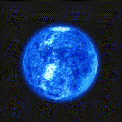

#  ParticleSun

Welcome to the ParticleSun project! This project is a visually engaging representation of a sun's corona using particles and OpenGL. It incorporates realistic physics with a moon orbiting the sun based on Newton's Law and employs the Blinn-Phong shading model to the moon.

## Features

1. **Particle-based Sun Corona:**
   - The project leverages particles to create a stunning visual representation of a sun's corona. This immersive effect is achieved through OpenGL rendering techniques.
2. **OpenGL Backend:**
   - The project utilizes OpenGL as its backend, harnessing the power of this powerful graphics library to create a seamless and visually appealing experience.
3. **Moon Orbiting Simulation:**
   - The moon in the visualization follows Newton's Law of Universal Gravitation to simulate a realistic orbit around the sun. I used semi-Euler method to simulate the physics.
4. **Blinn-Phong Shading on Moon:**
   - The moon is rendered using the Blinn-Phong shading model, which enhances its surface appearance by taking into account the reflection and lighting effects. This contributes to a more realistic and visually appealing representation of the moon.
5. **Change Sun's Color :**
   - Dynamically changing the color of the sun by pressing the 1~6 number keys on keyboard. Experiment with different hues and intensities to create unique and captivating visual effects.

## Dependencies

Make sure you have the following dependencies installed:

- OpenGL Library
- Visual Studio 2022

## Snapshots

*Red Sun*

*Blue Sun*

## About

This project was created during my early exploration of graphics programming as a beginner. 