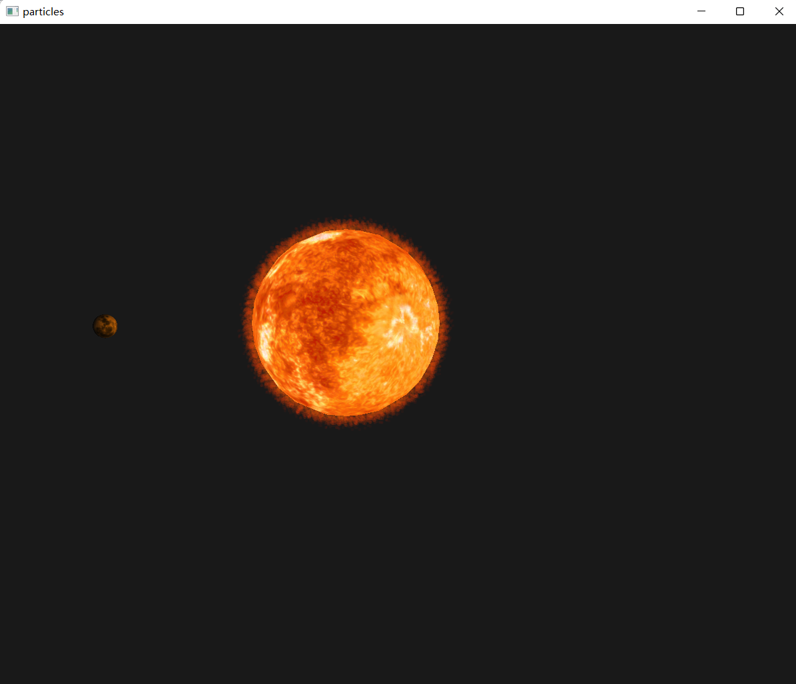
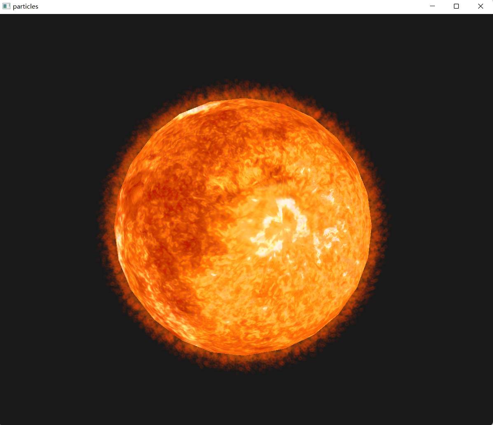
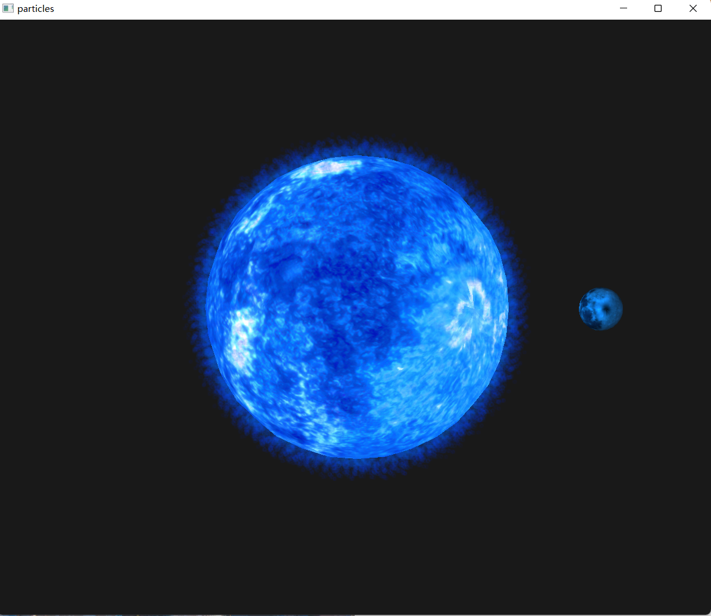

# 图形学第三次小作业

#### 作者：李秉轩        2000012930

## 1. 预览

​		在本次作业中，我实现了太阳光环的粒子特效，并在一个围绕着太阳转动的月球上实现了 Blinn-Phong 光照模型。实现效果如图：

## 2. 如何运行

​		可以在 particles/particles/ 路径下找到可执行文件 particles.exe。本程序中所有读取文件的路径都是相对路径，因此在不同的windows电脑上应该都能直接运行（前提是不改变相对路径，比如不能移动可执行文件，不能重命名文件夹）。

​		此外，如果有 VS 2022 则可以打开 particles/ 路径下的 particles.sln 工程文件，低版本的VS（如2019）可能出现不兼容的问题。

## 3. 交互方式

​		wasd 控制相机前后左右移动，空格控制相机向上移动，左shift控制相机向下移动。

​		鼠标控制相机朝向，鼠标滚轮缩放。由于采用了第一人称相机，运行程序后光标会消失，此时按 esc 可以退出程序。

​		按 1、2、3、4、5、6 键可以改变太阳、特效及光照的颜色，一共有六种选择。比如下图展现的就是蓝色的太阳：

## 4. 实现细节

### 4.1 太阳模型的获取

​		太阳模型及其贴图的获取是一件比较麻烦的事。花了一定时间搜索后，我最后在B站上找到了一个比较合适的模型（https://www.bilibili.com/video/BV1uS4y1g7U2?spm_id_from=333.880.my_history.page.click）。这是一个比较大的场景，我用blender把太阳挑了出来，导出成 .obj 格式，再用 python 写了一个脚本，将其转化成我方便在OpenGL中使用的.vbo格式（我自己的一个格式）。所有的材质、模型等都在resources文件夹中。

​		月亮和太阳采用的是一个模型，只是材质不同，实际效果还可以。

### 4.2 月球的运动与光照

​		月球的运动用物理模拟实现，最后呈现出的轨迹是一个椭圆。模拟采用了semi-Euler的方法，因为其代码量和显式Euler一样，但稳定性更好。

​		月球的光照采用Blinn-Phong模型。值得注意的是由于太阳的体积较大，直接用一个中心的点光源来照明会导致效果很不真实。因此，我用了七个点光源来代表太阳的光照：一个在中心，其他六个围绕中心成正八面体。

### 4.3 粒子特效的实现

​		本程序默认使用了11025个立方体粒子来实现特效，粒子数量可以在main函数前的宏中修改。

​		首先，我们对柱坐标系的 $\theta$ 和 $z$ 进行 105 $\times$ 105 的均匀采样，并对每个点的位置进行随机扰动。使得我们的粒子比较均匀的分布在球体表面，但又有一定随机性。

​		其次，我们让每个粒子随时间做远离圆心的直线运动，在运动过程中，粒子的不透明度降低，颜色由橘黄色渐变至红色。当粒子离圆心的距离超出一定值之后，我们把它放回球面，再重复上述过程。

​		最后，我们对立方体粒子进行贴图，比较明显的提升了粒子特效的质感。

​		程序中的实现细节可能更多一些，但基本流程如上所述。

